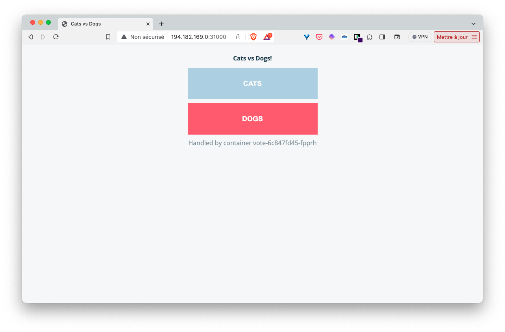
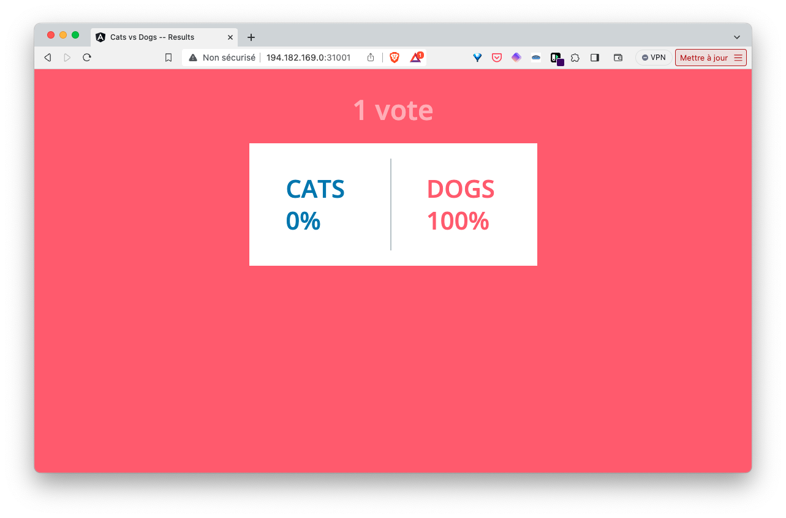

## Exercice

1. Dans le répertoire *votingapp* remplacez chaque spécification de Pod par une spécification de Deployment avec un seul réplica.  
Nommez les fichiers de ces Deployments *deploy-XXX.yaml* ou XXX est le nom du microservice (*voteui*, *vote*, ...)

2. Lancez l'application définie dans cette spécification

3. Accédez aux interface de vote et de result via les Services de type NodePort

4. Supprimez un Pod, que se passe t'il ?

5. Supprimez l'application

<details>
  <summary markdown="span">Solution</summary>

1. Les spécifications des Deployments sont les suivantes:

deploy-voteui.yaml:
```
apiVersion: apps/v1
kind: Deployment
metadata:
  labels:
    app: vote-ui
  name: vote-ui
spec:
  replicas: 1
  selector:
    matchLabels:
      app: vote-ui
  template:
    metadata:
      labels:
        app: vote-ui
    spec:
      containers:
        - image: registry.gitlab.com/voting-application/vote-ui:latest
          name: vote-ui
```

deploy-vote.yaml:
```
apiVersion: apps/v1
kind: Deployment
metadata:
  labels:
    app: vote
  name: vote
spec:
  replicas: 1
  selector:
    matchLabels:
      app: vote
  template:
    metadata:
      labels:
        app: vote
    spec:
      containers:
        - image: registry.gitlab.com/voting-application/vote:latest
          name: vote
```

deploy-redis.yaml:
```
apiVersion: apps/v1
kind: Deployment
metadata:
  labels:
    app: redis
  name: redis
spec:
  replicas: 1
  selector:
    matchLabels:
      app: redis
  template:
    metadata:
      labels:
        app: redis
    spec:
      containers:
        - image: redis:7.0.8-alpine3.17
          name: redis
```

deploy-worker.yaml:
```
apiVersion: apps/v1
kind: Deployment
metadata:
  labels:
    app: worker
  name: worker
spec:
  replicas: 1
  selector:
    matchLabels:
      app: worker
  template:
    metadata:
      labels:
        app: worker
    spec:
      containers:
        - image: registry.gitlab.com/voting-application/worker:go
          name: worker
```

deploy-db.yaml:
```
apiVersion: apps/v1
kind: Deployment
metadata:
  labels:
    app: db
  name: db
spec:
  replicas: 1
  selector:
    matchLabels:
      app: db
  template:
    metadata:
      labels:
        app: db
    spec:
      containers:
        - image: postgres:15.1-alpine3.17
          name: postgres
          env:
            - name: POSTGRES_PASSWORD
              value: postgres
          ports:
            - containerPort: 5432
              name: postgres
```

deploy-result.yaml:
```
apiVersion: apps/v1
kind: Deployment
metadata:
  labels:
    app: result
  name: result
spec:
  replicas: 1
  selector:
    matchLabels:
      app: result
  template:
    metadata:
      labels:
        app: result
    spec:
      containers:
        - image: registry.gitlab.com/voting-application/result:latest
          name: result
```

deploy-resultui.yaml:
```
apiVersion: apps/v1
kind: Deployment
metadata:
  labels:
    app: result-ui
  name: result-ui
spec:
  replicas: 1
  selector:
    matchLabels:
      app: result-ui
  template:
    metadata:
      labels:
        app: result-ui
    spec:
      containers:
        - image: registry.gitlab.com/voting-application/result-ui:latest
          name: result-ui
```

2. Lancez l'application avec la commande suivante depuis le répertoire *votingapp*:

```
kubectl apply -f .
```

3. Comme précédemmetn, en utilisant l'adresse IP d'un des nodes du cluster, nous pouvons accéder aux interfaces de vote et de result via les ports *31000* et *31001* respectivement.





4. Chaque Pod est maintenant géré par un Deployment. Si l'on supprime un Pod, un autre Pod est recréé pour prendre sa place.

Liste des Pods:
```
$ kubectl get po
NAME                         READY   STATUS    RESTARTS   AGE
db-647c8f548b-j7z79          1/1     Running   0          3m35s
redis-6f95f75d56-7gwjz       1/1     Running   0          3m35s
result-7f897b4d58-qqtt4      1/1     Running   0          3m35s
result-ui-5cdd74d999-q5tx7   1/1     Running   0          3m34s
vote-6c847fd45-fpprh         1/1     Running   0          3m35s
vote-ui-74849dd9b4-gwcq9     1/1     Running   0          3m35s
worker-8655654586-k44vw      1/1     Running   0          3m35s
```

Suppression d'un Pod (par exemple *worker*):

```
$ kubectl delete po worker-8655654586-k44vw 
pod "worker-8655654586-k44vw" deleted
```

Un nouveau Pod est automatiquement lancé pour remplacer celui qui vient d'être supprimé.

```
$ kubectl get po                                 
NAME                         READY   STATUS    RESTARTS   AGE
db-647c8f548b-j7z79          1/1     Running   0          5m15s
redis-6f95f75d56-7gwjz       1/1     Running   0          5m15s
result-7f897b4d58-qqtt4      1/1     Running   0          5m15s
result-ui-5cdd74d999-q5tx7   1/1     Running   0          5m14s
vote-6c847fd45-fpprh         1/1     Running   0          5m15s
vote-ui-74849dd9b4-gwcq9     1/1     Running   0          5m15s
worker-8655654586-mmzgh      1/1     Running   0          4s
```

Un Deployment s'assure donc que les Pods sont toujours présent. Si nous avions supprimé un Pod qui n'est pas géré par un Deployment (on parle de *Naked Pod*) aucun Pod n'aurait été lancé automatiquement pour le remplacer.

5. Nous supprimons l'application avec la commande suivante

```
kubectl delete -f vote.yaml
```

</details>