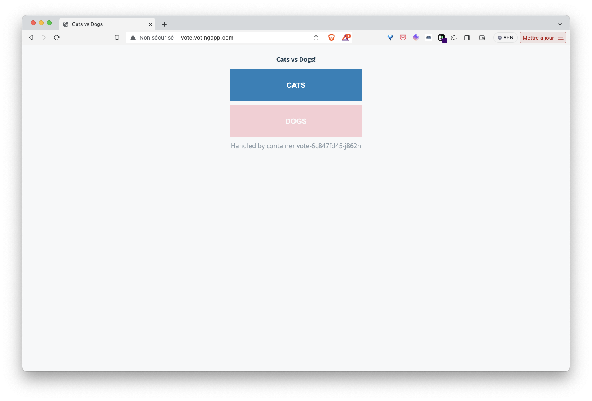
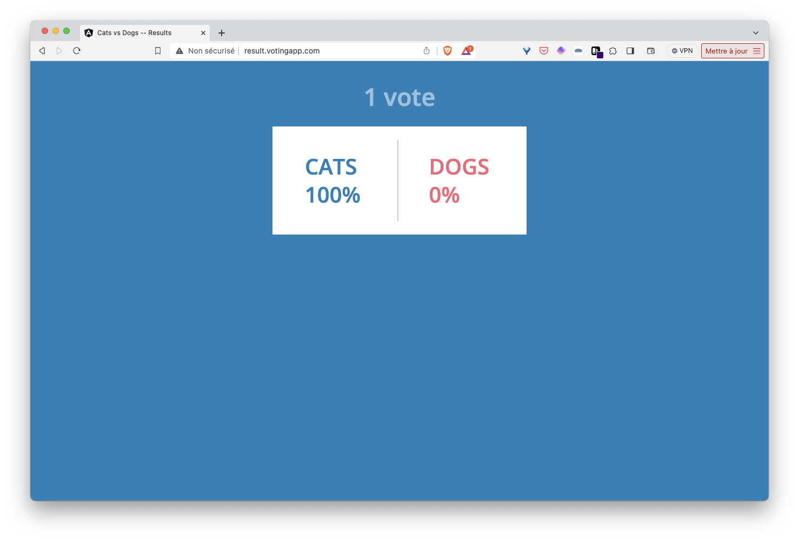
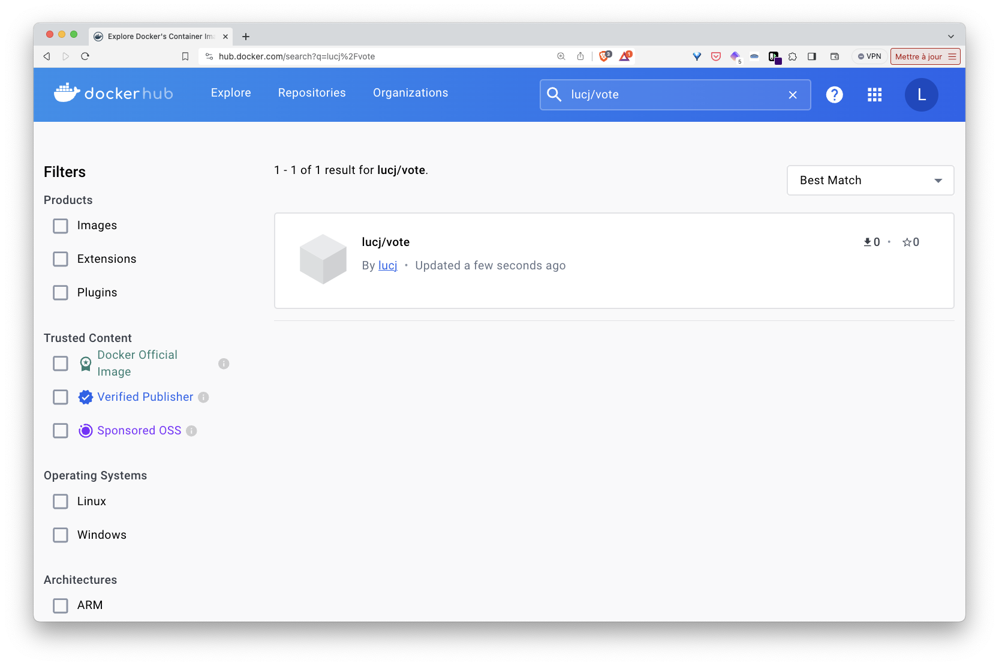
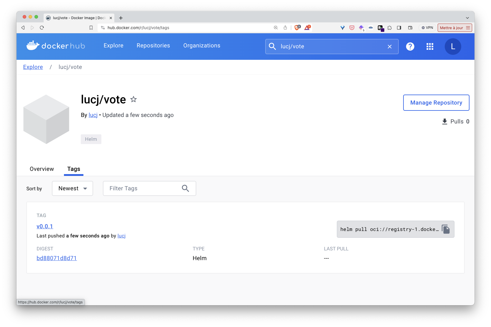

Dans cet exercice vous allez packager l'application VotingApp dans un Chart Helm

1. Installer le client Helm

Depuis votre VM, installez le client Helm à l'aide des commandes suivantes:

```
curl -fsSL -o get_helm.sh https://raw.githubusercontent.com/helm/helm/main/scripts/get-helm-3
chmod 700 get_helm.sh
./get_helm.sh
```

2. Création d'un Chart Helm

Utilisez la commande suivante afin de créer un Chart nommé *vote*.

```
helm create vote
```

Par défaut, celui-ci contient principalement les éléments suivants:

- un fichier *Chart.yaml* qui définit les metadata du projet
- un template pour la création d'un Deployment qui gère un Pod unique (basé sur nginx)
- un template pour la création d'un Service afin d'exposer ce Pod à l'intérieur du cluster
- un template pour la création d'une ressource Ingress pour exposer le service à l'extérieur
- un fichier *values.yaml* utilisé pour substituer les placeholders présents dans les templates par des valeurs dynamiques
- un fichier *NOTES.txt* qui donne des informations à la création de la release et lors des mises à jour

Vous pouvez visualiser son contenu avec la commande tree (à installer au préalable avec "sudo apt install tree"):

```
$ tree vote/
vote/
├── Chart.yaml
├── charts
├── templates
│   ├── NOTES.txt
│   ├── _helpers.tpl
│   ├── deployment.yaml
│   ├── hpa.yaml
│   ├── ingress.yaml
│   ├── service.yaml
│   ├── serviceaccount.yaml
│   └── tests
│       └── test-connection.yaml
└── values.yaml
```

Premièrement, dans le répertoire *templates*, supprimez les fichiers yaml, le fichier *NOTES.txt* et le répertoire *test*.  
Ensuite copiez dans le répertoire *temmlates* tous les fichiers manifests de la VotingApp  
Supprimez également le contenu du fichier *values.yaml* mais ne supprimez pas le fichier

Le répertoire *votingapp* aura alors le contenu suivant:

```
$ tree vote/
vote/
├── Chart.yaml
├── charts
├── templates
│   ├── _helpers.tpl
│   ├── cronjob.yaml
│   ├── deploy-db.yaml
│   ├── deploy-redis.yaml
│   ├── deploy-result.yaml
│   ├── deploy-resultui.yaml
│   ├── deploy-vote.yaml
│   ├── deploy-voteui.yaml
│   ├── deploy-worker.yaml
│   ├── ingress.yaml
│   ├── pvc-db.yaml
│   ├── pvc-redis.yaml
│   ├── secret-db.yaml
│   ├── svc-db.yaml
│   ├── svc-redis.yaml
│   ├── svc-result.yaml
│   ├── svc-resultui.yaml
│   ├── svc-vote.yaml
│   └── svc-voteui.yaml
└── values.yaml
```

3. Lancement de l'application

Depuis le répertoire *vote* lancez l'application à l'aide de la commande suivante:

```
helm upgrade --install vote .
```

Vous obtiendrez un résultat similaire à celui ci-dessous:

```
Release "vote" does not exist. Installing it now.
NAME: vote
LAST DEPLOYED: Tue Feb 13 10:27:48 2024
NAMESPACE: default
STATUS: deployed
REVISION: 1
TEST SUITE: None
```

Vérifiez ensuite que l'ensemble des Pods de la VotingApp sont dans le status Running:

```
$ kubectl get po
NAME                         READY   STATUS      RESTARTS   AGE
worker-56b544777-nt6wf       1/1     Running     0          45s
result-ui-5cdd74d999-bpwkj   1/1     Running     0          45s
vote-6c847fd45-jqvhr         1/1     Running     0          45s
vote-ui-74849dd9b4-gbmbp     1/1     Running     0          45s
redis-5c4f4598f5-n8kxf       1/1     Running     0          45s
result-854cd4779c-w4jhm      1/1     Running     0          45s
db-54d89ccb97-nxz7v          1/1     Running     0          45s
seed-28463608-dwgst          0/1     Completed   0          34s
```

Assurez-vous que l'application est accessible sur *http://vote.votingapp.com* / *http://result.votingapp.com* (ou sur *http//vote.IP_DE_VOTRE_VM.nip.io* / *http://result.IP_DE_VOTRE_VM.nip.io si vous utilisez l'approche nip.io)





4. Utilisation du templating

- tag des images

Vous allez faire en sorte que les tags des images ne soient plus basés sur *latest* (ce qui est d'ailleurs une très mauvaise pratique) mais sur une valeur que vous allez spécifier dans le fichier *values.yaml*

Tout dabord, ajoutez le contenu suivant dans *values.yaml*:

```
registry: voting
voteui:
  tag: v1.0.19
vote:
  tag: v1.0.13
worker:
  tag: v1.0.15
result:
  tag: v1.0.16
resultui:
  tag: v1.0.15
tools:
  tag: v1.0.4
```

Puis modifiez les spécifications des Deploiements *voteui*, *vote*, *worker*, *result* et *resultui* de façon à ce que le nom de l'image soit générée à partir des valeurs des propriétés *registry* et du *tag* correspondant au microservice.

Par example, la spécification du Deployment voteui sera modifiée de la façon suivante:

```
apiVersion: apps/v1
kind: Deployment
metadata:
  labels:
    app: vote-ui
  name: vote-ui
spec:
  replicas: 1
  selector:
    matchLabels:
      app: vote-ui
  template:
    metadata:
      labels:
        app: vote-ui
    spec:
      containers:
        - image: {{ .Values.registry }}/vote-ui:{{ .Values.voteui.tag }}
          name: vote-ui
```

- génération régulière de votes

Vous allez à présent faire en sorte que 5 votes fictifs soient créés toutes les 2 minutes

Ajoutez le contenu suivant à la fin du fichier *values.yaml*

```
# Add dummy votes on a regular basis
seed: enabled
schedule: "*/2 * * * *"
number_of_votes: 5
```

Puis modifiez la specification *cronjob.yaml* de la façon suivante:

```
{{ if .Values.seed }}{{ if eq .Values.seed "enabled" }} 
apiVersion: batch/v1
kind: CronJob
metadata:
  name: seed
spec:
  schedule: "{{ .Values.schedule }}"
  jobTemplate:
    metadata:
      name: seed
    spec:
      template:
        spec:
          containers:
          - image: voting/tools:{{ .Values.tools.tag }}
            name: seed
            env:
            - name: NUMBER_OF_VOTES
              value: "{{ .Values.number_of_votes }}"
            imagePullPolicy: Always
          restartPolicy: OnFailure
{{ end }}{{ end }}
```

Cette spécification utilise le langage de templating de Helm:
- le cronjob est créé seulement si la propriété *seed* existe et est égale à "enabled" dans le fichier de values
- le schedule du cronjob est récupéré depuis la propriété *schedule* du fichier de values
- le nombre de vote est définit dans la variable d'environnement *NUMBER_OF_VOTES* dont la valeur est également récupéréé dans le fichier de values

Mettez à jour l'application en utilisant la même commande que celle utilisée pour la création:

```
helm upgrade --install vote .
```

Note: le fichier *values.yaml* est pris en compte par défaut

La seconde révision de l'application sera alors créée:

```
Release "vote" has been upgraded. Happy Helming!
NAME: votingapp
LAST DEPLOYED: Tue Feb 13 11:05:21 2024
NAMESPACE: default
STATUS: deployed
REVISION: 2
TEST SUITE: None
```

Vous pouvez également voir que les différents Pod ont été recréés pour prendre en compte les modifications faites dans leur spécification:

```
$ kubectl get po
NAME                         READY   STATUS      RESTARTS   AGE
db-54d89ccb97-mp28m          1/1     Running     0          31m
redis-5c4f4598f5-wgw2r       1/1     Running     0          31m
seed-28463643-s2kzd          0/1     Completed   0          2m34s
seed-28463644-n5b4w          0/1     Completed   0          94s
seed-28463645-4kmqc          0/1     Completed   0          34s
result-ui-76bdf59f99-qks6w   1/1     Running     0          13s
vote-779875ff5b-t7drr        1/1     Running     0          13s
vote-ui-695759b448-c7jgw     1/1     Running     0          13s
result-66f5856c8b-xp9d6      1/1     Running     0          13s
worker-6c5d7ddcf5-hprn7      1/1     Running     0          12s
```

Depuis l'interface de result, vérifiez que 5 nouveaux votes sont créés toutes les 2 minutes

5. Suppression de l'application

Utilisez la commande suivante pour supprimer l'application:

```
helm uninstall vote
```

6. Distribution de l'application

Un Chart Helm peut facilement être packagé et distribué dans un registry OCI comme le [DockerHub](https://hub.docker.com).  

Premièrement, utilisez la commande suivante pour vous connecter au Docker Hub (si vous n'avez pas de compte sur le Docker Hub, vous pouvez en [créer un gratuitement](https://hub.docker.com/signup) en quelques instants): 

```
echo $DOCKERHUB_PASSWORD | helm registry login registry-1.docker.io -u $DOCKERHUB_USERNAME --password-stdin
```

Puis, créez un package de l'application (on spécifiera la version v0.0.1 de l'application):

```
helm package --version v0.0.1 .
```

Vous pouvez ensuite envoyer ce package sur le DockerHub:

```
helm push vote-v0.0.1.tgz oci://registry-1.docker.io/$DOCKERHUB_USERNAME
```

L'application est à présent disponible et prête à être récupérée depuis le Docker Hub




