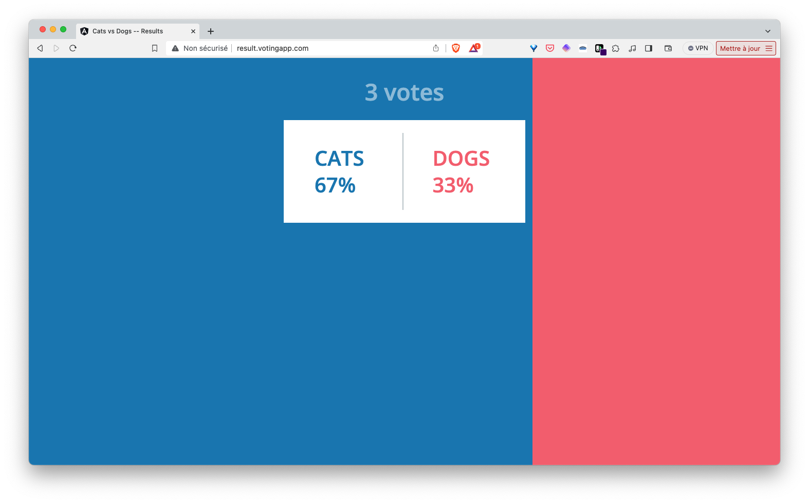

## Exercice

1. Dans un fichier *ingress.yaml*, définissez la spécification d'une ressource *Ingress* dont les caractéristiques sont les suivantes:

- nom: vote
- ingressClassName: traefik
- toutes les requêtes à destination de l'URL *vote.votingapp.com* doivent être redirigées vers le port 80 du service *vote-ui* 
- toutes les requêtes à destination de l'URL *result.votingapp.com* doivent être redirigées vers le port 80 du service *result-ui* 

Mettez à jour votre fichier */etc/hosts* de façon à ce que les URL *vote.votingapp.com* et *result.votingapp.com* soient résolues avec l'adresse IP de la VM que vous utilisez pour faire ces exercices.

Par exemple, si vous utilisez une VM créée avec [Multipass](https://multipass.run) vous pouvez récupérer son adresse IP avec la commande:

```
multipass info VM_NAME
```

Vous devez alors modifier votre */etc/hosts* en ajoutant l'enregistrement suivant:

```
...
IP_DE_VOTRE_VM vote.votingapp.com result.votingapp.com
```

Note: si vous n'avez pas les droits nécessaire pour modifier votre ficher */etc/hosts*, je vous recommande d'utiliser le service *nip.io* et d'utiliser les noms de domaines *vote.IP_DE_VOTRE_VM.nip.io* / *result.IP_DE_VOTRE_VM.nip.io* au lieu de *vote.votingapp.com* / *result.votingapp.com* dans la définition de votre ressource Ingress.

2. Lancez l'application et vérifiez que l'interface de vote est disponible sur l'URL *http://vote.votingapp.com* et que l'interface de result est disponible sur l'URL *http://result.votingapp.com* (ou sur *http//vote.IP_DE_VOTRE_VM.nip.io* / *http://result.IP_DE_VOTRE_VM.nip.io si vous utilisez l'approche nip.io)

3. Supprimez l'application

<details>
  <summary markdown="span">Solution</summary>

1. La spécification de la ressource ingress est la suivante:

ingress.yaml:
```
apiVersion: networking.k8s.io/v1
kind: Ingress
metadata:
 name: vote
spec:
 ingressClassName: traefik
 rules:
 - host: vote.votingapp.com
   http:
     paths:
     - path: /
       pathType: Prefix
       backend:
         service:
           name: vote-ui
           port:
             number: 80
 - host: result.votingapp.com
   http:
     paths:
     - path: /
       pathType: Prefix
       backend:
         service:
           name: result-ui
           port:
             number: 80
```


2. Nous lançons l'application avec la commande suivante depuis le répertoire *manifests*:

```
kubectl apply -f .
```

Nous pouvons alors accéder aux différentes interfaces depuis de vrais noms de domaines et non plus via un numéro de port




3. Nous supprimons l'application avec la commande suivante depuis le répertoire *manifests*:

```
kubectl delete -f .
```
