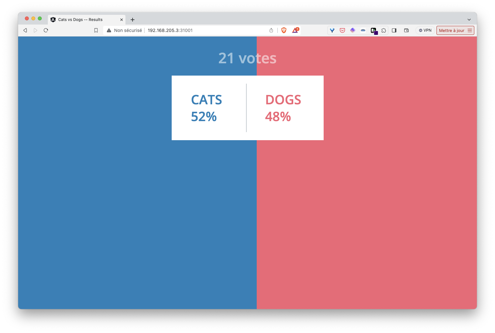

## Exercice

1. Dans un fichier *cronjob.yaml*, définissez la spécification d'une ressource *Cronjob* dont les caractéristiques sont les suivantes:

- nom: seed
- schedule: "* * * * *"
- contenant un seul container dont l'image est *voting/tools:latest* et dont la variable d'environnement *NUMBER_OF_VOTES* a la valeur 10

2. Lancez l'application et vérifiez, depuis l'interface *resultui*, que 10 nouveaux votes sont créés toutes les minutes

3. Supprimez l'application

<details>
  <summary markdown="span">Solution</summary>

1. La spécification permettant de définir le CronJob *seed* est la suivante:

cronjob.yaml:
```
apiVersion: batch/v1
kind: CronJob
metadata:
  name: seed
spec:
  schedule: "* * * * *"
  jobTemplate:
    metadata:
      name: seed
    spec:
      template:
        spec:
          containers:
          - image: voting/tools:latest
            name: seed
            env:
            - name: NUMBER_OF_VOTES
              value: "10"
            imagePullPolicy: Always
          restartPolicy: OnFailure
```


2. Nous lançons l'application avec la commande suivante depuis le répertoire *manifests*:

```
kubectl apply -f .
```

Comme précédement, en utilisant l'adresse IP d'un des nodes du cluster, nous pouvons accéder aux interfaces de vote et de result via les ports *31000* et *31001* respectivement. Si nous observons l'interface de *result* quelques minutes nous verrons que 10 nouveaux votes sont créés chaque minute.



3. Nous supprimons l'application avec la commande suivante depuis le répertoire *manifests*:

```
kubectl delete -f .
```
