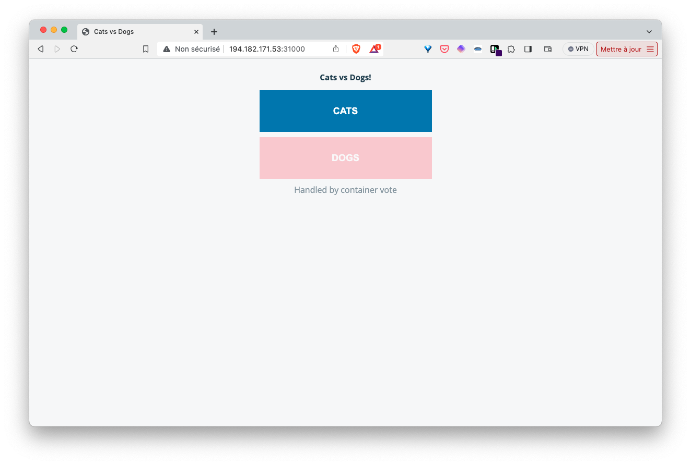
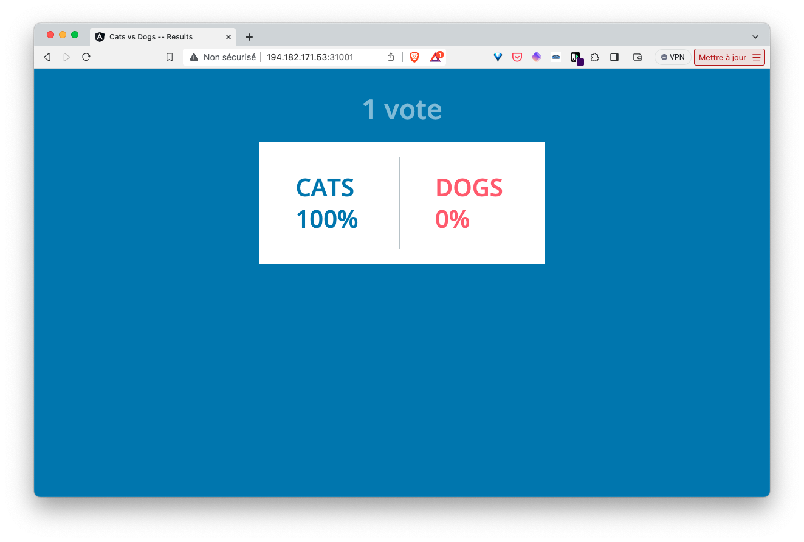

## Exercice

1. Dans le répertoire *votingapp* créez les fichiers yaml contenant les spécifications des Services de chaque microservice de l'application en respectant les éléments du tableau suivant:

| Microservice | Nom du fichier        | Type du Service  | Details du Service                       |
| ---          | ---                   | ---              | ---                                      |
| Vote UI      | service-voteui.yaml   | NodePort (31000) | nodePort 31000, port: 80, targetPort: 80 |
| Vote         | service-vote.yaml     | ClusterIP        | nodePort 31000, port: 80, targetPort: 80 |
| Redis        | service-redis.yaml    | ClusterIP        | port: 6379, targetPort: 6379             |
| Postgres     | service-db.yaml       | ClusterIP        | port: 5432, targetPort: 5432             |
| Result       | service-result.yaml   | ClusterIP        | port: 5000, targetPort: 5000             |
| Result UI    | service-resultui.yaml | NodePort (31001 )| nodePort 31001, port: 80, targetPort: 80 |

Vous noterez qu'il n'est pas nécessaire d'exposer le Pod *worker* avec un Service can aucun Pod n'a besoin de s'y connecter. Au contraire, c'est le Pod *worker* qui se connecte à *redis* et à *db*.

Pour chaque couple Pod/Service, asssurez vous de bien définir un label dans le Pod et le *selector* correspondant dans le Service.

2. Lancez l'application définie dans cette spécification

3. Accédez aux interface de vote et de result via les Services de type NodePort

4. Supprimez l'application

<details>
  <summary markdown="span">Solution</summary>

1. Les spécifications des Services sont les suivantes:

service-voteui.yaml
```
apiVersion: v1
kind: Service
metadata:
  labels:
    app: vote-ui
  name: vote-ui
spec:
  type: NodePort
  ports:
    - port: 80
      targetPort: 80
      nodePort: 31000
  selector:
    app: vote-ui
```

service-vote.yaml:
```
apiVersion: v1
kind: Service
metadata:
  labels:
    app: vote
  name: vote
spec:
  ports:
    - port: 5000
      targetPort: 5000
  selector:
    app: vote
```

service-redis.yaml
```
apiVersion: v1
kind: Service
metadata:
  labels:
    app: redis
  name: redis
spec:
  type: ClusterIP
  ports:
  - port: 6379
    targetPort: 6379
  selector:
    app: redis
```

service-db.yaml:
```
apiVersion: v1
kind: Service
metadata:
  labels:
    app: db
  name: db
spec:
  type: ClusterIP
  ports:
  - port: 5432
    targetPort: 5432
  selector:
    app: db
```

service-result.yaml:
```
apiVersion: v1
kind: Service
metadata:
  labels:
    app: result
  name: result
spec:
  ports:
    - port: 5000
      targetPort: 5000
  selector:
    app: result
```

service-resultui.yaml:
```
apiVersion: v1
kind: Service
metadata:
  labels:
    app: result-ui
  name: result-ui
spec:
  type: NodePort
  ports:
    - port: 80
      targetPort: 80
      nodePort: 31001
  selector:
    app: result-ui
```

2. Lancez l'application avec la commande suivante depuis le répertoire *votingapp*:

```
kubectl apply -f .
```

3. Les différents Pod sont cette fois-ci dans le status Running:

```
$ kubectl get po,svc
NAME            READY   STATUS    RESTARTS   AGE
pod/db          1/1     Running   0          20s
pod/redis       1/1     Running   0          20s
pod/result      1/1     Running   0          20s
pod/result-ui   1/1     Running   0          20s
pod/vote        1/1     Running   0          20s
pod/vote-ui     1/1     Running   0          21s
pod/worker      1/1     Running   0          20s

NAME                 TYPE        CLUSTER-IP       EXTERNAL-IP   PORT(S)        AGE
service/db           ClusterIP   10.100.10.36     <none>        5432/TCP       20s
service/kubernetes   ClusterIP   10.96.0.1        <none>        443/TCP        29m
service/redis        ClusterIP   10.107.167.249   <none>        6379/TCP       20s
service/result       ClusterIP   10.105.157.142   <none>        5000/TCP       20s
service/result-ui    NodePort    10.101.30.191    <none>        80:31001/TCP   20s
service/vote         ClusterIP   10.96.108.192    <none>        5000/TCP       20s
service/vote-ui      NodePort    10.104.203.9     <none>        80:31000/TCP   20s
```

En utilisant l'adresse IP d'un des nodes du cluster, nous pouvons accéder aux interfaces de vote et de result via les ports *31000* et *31001* respectivement.





4. Nous supprimons l'application avec la commande suivante:

```
kubectl delete -f .
```

</details>