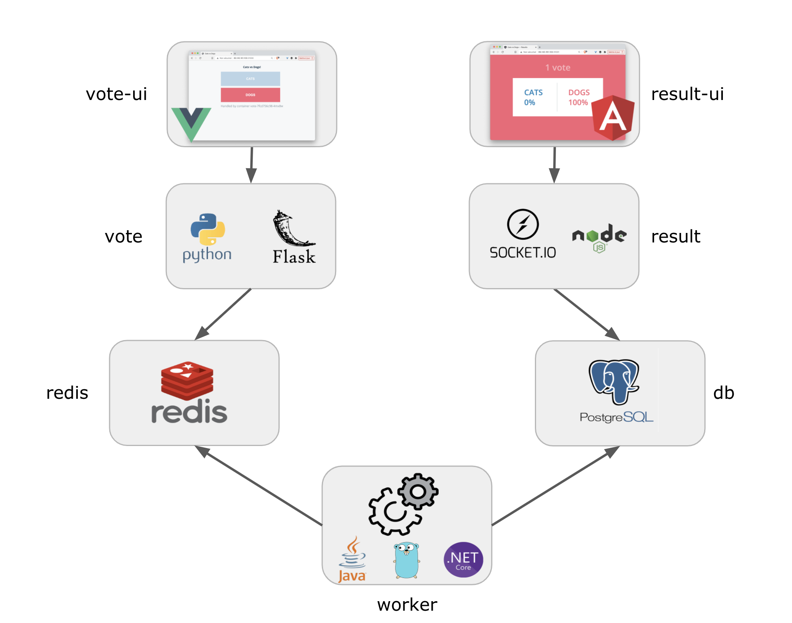

# VotingApp

La VotingApp est une application principalement utilisée pour les démos, elle suit une architecture microservices.

Cette application ne respecte pas forcément toutes les bonnes pratiques architecturales, mais elle est un bon exemple d'une application utilisant plusieurs langages, plusieurs bases de données et est un excellent moyen d'apprendre notamment les concepts liés à Docker et Kubernetes.

La VotingApp est composé de 7 microservices comme illustré dans le schéma suivant :

- vote-ui : Frontend en Vue.js qui permet à un utilisateur de choisir entre Cat et Dog
- vote : Backend exposant une API avec Python / Flask
- redis : Base de données où les votes sont stockés
- worker : Service qui récupère les votes depuis Redis et stocke les résultats dans une base de données Postgres
- db : La base de données Postgres dans laquelle les résultats des votes sont stockés
- result : Backend envoyant les scores à une interface utilisateur via websocket
- result-ui : Frontend en Angular affichant les résultats des votes

Vous pouvez voir une version live de cette application à l'adresse [https://vote.techwhale.io](https://vote.techwhale.io).